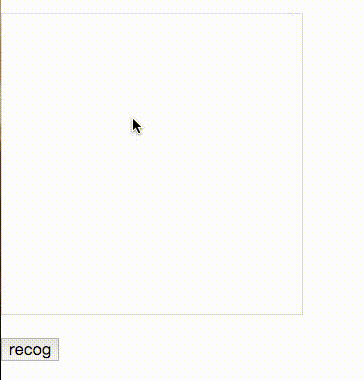

# number-recognition
 

 
基本上就是一个 TensorFlow 的第一个入门教程的示例，把识别的部分写成了基于 Flask 的一个 web api，然后通过 canvas 手写数字并传入服务端来识别数字。

可以看到现在识别率还很低，用的 mnist 数据训练。还没有添加卷积神经网络。

## 涉及技术

* Python
* TensorFlow
* Flask
* canvas
* JavaScript
